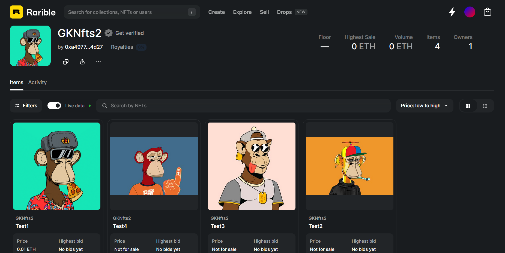

# 🎨 NFT Minting Smart Contract (ERC721)

A customizable ERC721 NFT minting smart contract built with **Solidity** and **OpenZeppelin**.  
Supports paid minting, max supply, pause control, and IPFS-based metadata.



---

## ✨ Features

- ✅ ERC721Enumerable (on-chain token tracking)
- 💰 Paid minting with adjustable cost
- 🔒 Owner controls (pause, cost, baseURI)
- 📦 IPFS-compatible metadata
- 🚀 Initial mint on deployment
- 🔐 Secure withdrawal pattern

---

## 📜 Smart Contract Overview

**Contract Name:** `NftMint`  
**Standard:** ERC721  
**License:** MIT  
**Solidity Version:** `^0.8.0`

---

## ⚙️ Constructor Parameters

```solidity
constructor(
    string memory _name,
    string memory _symbol,
    string memory _initBaseURI,
    uint256 _maxSupply,
    uint256 _initialMint
)